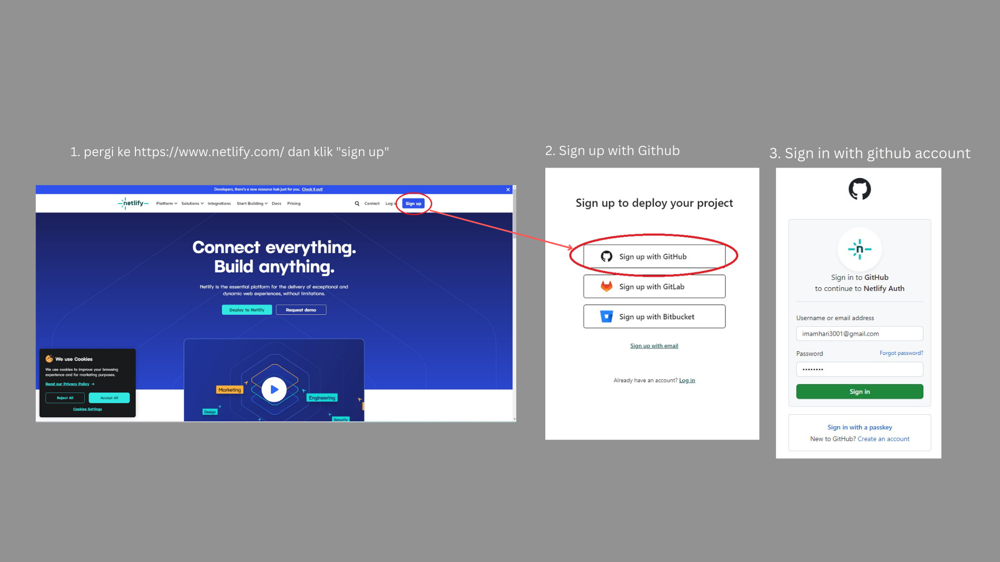
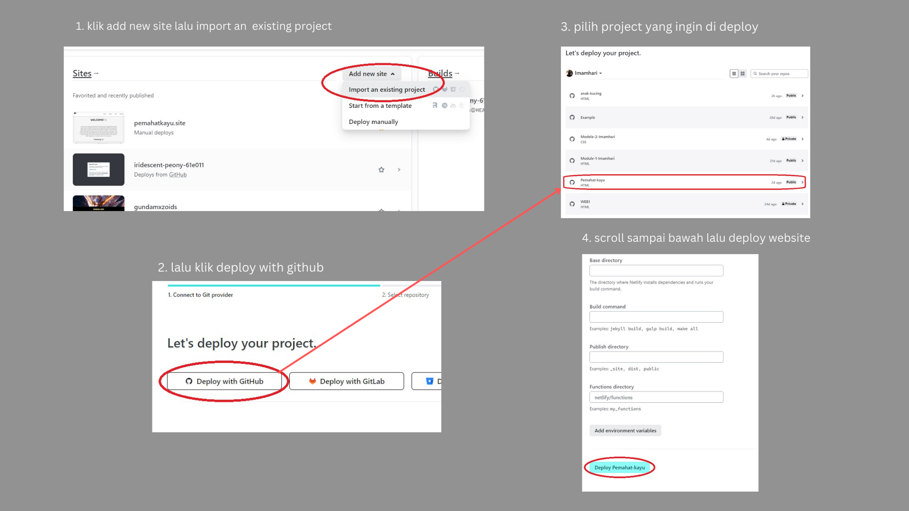
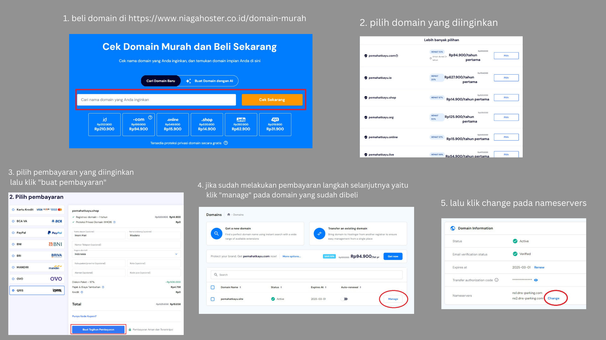
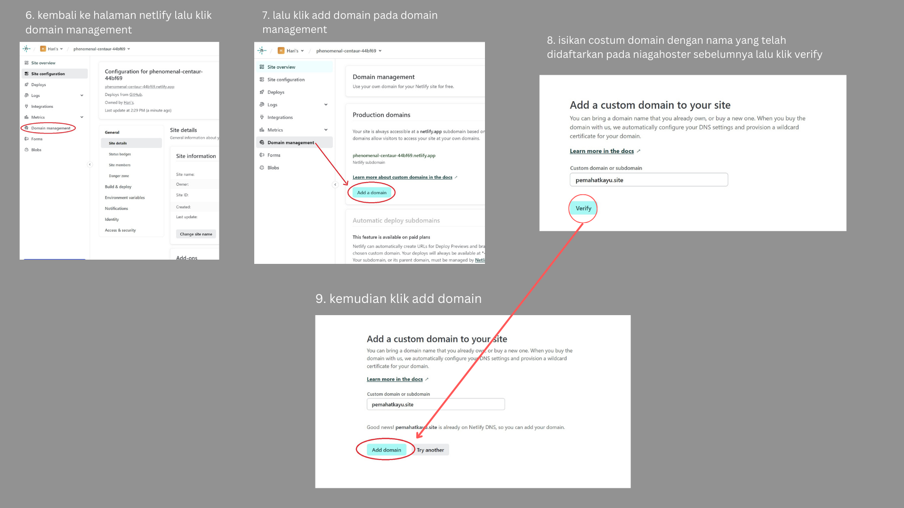
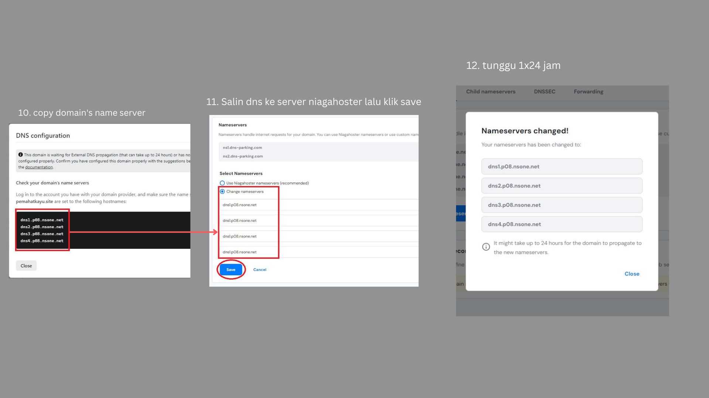

# Milestone 1


#### Link website:  https://pemahatkayu.site/

## Navigation bar
- Home
- Gallery
- Registration

## Materials
- HTML
- CSS
- Eksternal Sources
    - Image
    - icon
    
## How to set up
1. Clone this repository
```
https://github.com/RevoU-FSSE-4/milestone-1-Imamhari.git
```
2. Create a new branch named "branch1", in this repository we would like to develop the website with personal information. 
```
git branch -b "branch1"
```
3. Once it's created, checkout to a new branch
```
git checkout -b "branch1"
```
4. Develop & modify the website with your personal information, once it's done you will need to push it.
```
git add .
git commit -m "update message" // make sure to give details commit message to get better logs
git push origin branch1
```
5. Once you're done, you can merge into main/master branch for production build.
```
git checkout main
git pull origin main // pull the latest version before commit merge
git merge branch1 // if there are any conflicts, you should resolve them manually
git commit -m "Merge develop into main"
git push origin main
```

## Deployment
__Sign up Netlify & connect to github__


__Deployment on github with netlify__


__Connect costum domain and DNS__







